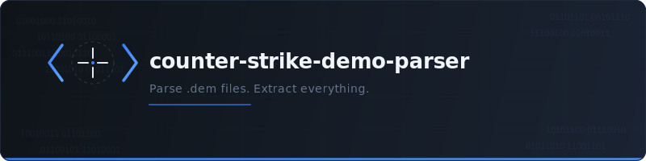

<p align="center">
  
</p>

**A streaming, fully-typed Counter-Strike demo parser for Node.js. CS:GO now, CS2 coming soon.**

[](https://www.npmjs.com/package/counter-strike-demo-parser)
[](./LICENSE)
[](https://nodejs.org)
[](https://www.typescriptlang.org)
[](https://github.com/yarikleto/counter-strike-demo-parser/actions)

---

Parse `.dem` files and extract everything: every tick, every entity, every event. Fully typed, streaming, zero native dependencies.

## Quick Start

```bash
npm install counter-strike-demo-parser
```

```typescript
import { DemoParser } from 'counter-strike-demo-parser';
import { readFileSync } from 'node:fs';

const buffer = readFileSync('match.dem');
const parser = DemoParser.fromBuffer(buffer);

parser.on('playerDeath', (event) => {
  const hs = event.headshot ? ' (headshot)' : '';
  console.log(`${event.attacker?.name} killed ${event.victim.name} with ${event.weapon}${hs}`);
});

parser.parseAll();
```

## Features

- **Full player state** — position, health, armor, inventory, money, angles, and 30+ properties at every tick
- **All game events** — kills, assists, bomb plants, round ends, and 100+ other typed events
- **Grenade trajectories** — follow every smoke, flash, molotov, and HE from throw to detonation
- **Economy tracking** — money, purchases, equipment value per player per round
- **Complete entity system** — every networked object decoded via SendTable/ServerClass with delta compression
- **Streaming architecture** — constant memory usage regardless of demo length
- **Zero native dependencies** — pure TypeScript, works everywhere Node.js runs
- **Full TypeScript types** — every event, every entity property, every API surface is typed

## Examples

### Match Scoreboard

```typescript
import { DemoParser } from 'counter-strike-demo-parser';
import { readFileSync } from 'node:fs';

const parser = DemoParser.fromBuffer(readFileSync('match.dem'));

parser.on('parseEnd', () => {
  for (const player of parser.players) {
    console.log(
      `${player.name.padEnd(20)} K: ${player.kills}  D: ${player.deaths}  A: ${player.assists}  ` +
      `Score: ${player.score}  MVPs: ${player.mvps}`
    );
  }
});

parser.parseAll();
```

### Position Heatmap Data

```typescript
const positions: { x: number; y: number; team: string }[] = [];

parser.on('tickEnd', () => {
  for (const player of parser.players) {
    if (player.isAlive) {
      positions.push({
        x: player.position.x,
        y: player.position.y,
        team: player.side,
      });
    }
  }
});

parser.parseAll();
// positions now contains every alive player's location at every tick
```

### Grenade Trajectories

```typescript
parser.on('grenadeThrown', (event) => {
  console.log(`${event.player.name} threw ${event.grenadeType} from (${event.origin.x}, ${event.origin.y})`);
});

parser.on('hegrenadeDetonate', (event) => {
  console.log(`HE grenade detonated at (${event.position.x}, ${event.position.y})`);
});

parser.on('flashbangDetonate', (event) => {
  console.log(`Flashbang detonated at (${event.position.x}, ${event.position.y})`);
});

parser.parseAll();
```

### Round-by-Round Economy

```typescript
parser.on('roundFreezeEnd', () => {
  const round = parser.gameState.roundNumber;
  for (const player of parser.players) {
    console.log(
      `[Round ${round}] ${player.name.padEnd(20)} $${player.money}`
    );
  }
});

parser.parseAll();
```

## API Overview

| Class / Type | Description |
|---|---|
| `DemoParser` | Main entry point. Create from a buffer, subscribe to events, call `parseAll()`. |
| `Player` | Full player state: position, health, armor, weapons, money, stats, and more. |
| `Team` | Team name, score, player list, side (CT/T). |
| `GameState` | Current round, phase, bomb state, map, server info. |
| `GameEvent` | Discriminated union of 100+ typed game events. |
| `Entity` | Low-level networked entity with typed property access. |

## Supported Data

**Player state** (per tick): position, angles, velocity, health, armor, helmet, defuse kit, money, equipment value, active weapon, all weapons, ammo, scope state, flash duration, burn duration, alive/dead, connected, team, Steam ID, and more.

**Game events** (100+ types): player_death, round_start, round_end, bomb_planted, bomb_defused, weapon_fire, player_hurt, flashbang_detonate, smokegrenade_detonate, hegrenade_detonate, molotov_detonate, begin_new_match, round_mvp, player_connect, player_disconnect, and many more.

**Entity system**: full SendTable/ServerClass decoding, delta compression, every networked object in the game (players, weapons, projectiles, C4, world entities).

**String tables**: model precache, user info, server info, downloadables.

**Other**: console commands, user messages, chat messages, voice data (raw CELT frames), server metadata, demo header (map, duration, tick count, protocol version).

## Performance

Built for speed from the ground up:

- **Streaming architecture** — constant memory regardless of demo size. Parse gigabytes without breaking a sweat.
- **Optional native C++ addon** — hot-path acceleration via N-API for the BitReader and entity decoding. Drop-in, zero API changes, automatic fallback to pure TypeScript when native module isn't available.
- **Optimized bit-level readers** — the inner loops that decode millions of entity property updates per demo are tuned for V8.

Pure TypeScript works everywhere out of the box. Add the native addon when you need maximum throughput.

## Other Parsers

There are demo parsers in other languages. Here's how they compare:

| | **counter-strike-demo-parser** | demoinfocs-golang | demofile | demoparser2 |
|---|---|---|---|---|
| Language | **TypeScript** | Go | JavaScript | Rust/Python |
| API | **Streaming + typed events** | Streaming | Streaming | Query-based |
| TypeScript types | **Full** | N/A | Partial | N/A |
| CS:GO support | **Yes** | Yes | Yes | Yes |
| CS2 support | **Planned** | Yes | No | Yes |
| Maintained | **Yes** | Yes | No (3+ years) | Yes |
| Native acceleration | **Optional C++ addon** | N/A | N/A | Rust core |
| Node.js native | **Yes** | No | Yes | No (Python bindings) |

If you're in the Node.js/TypeScript ecosystem — this is the parser to use.

## Roadmap

- **v1** — CS:GO demo parsing: full entity system, all game events, player/team/round state, streaming API
- **v2** — CS2 demo parsing: Source 2 format support (separate API surface — CS2 uses a fundamentally different entity system)
- **Performance** — optional native C++ addon for hot-path acceleration
- **Convenience** — grenade trajectories, economy tracking, damage matrix, match summaries

## Contributing

Contributions are welcome. Please open an issue before starting work on anything substantial so we can discuss the approach.

```bash
git clone https://github.com/yarikleto/counter-strike-demo-parser.git
cd counter-strike-demo-parser
npm install
npm test
```

## License

[MIT](./LICENSE)
